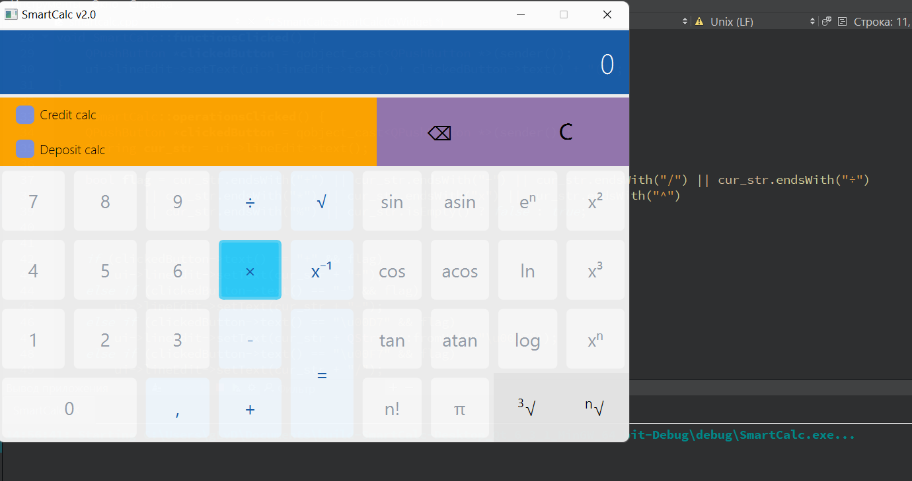

# Smart-Calculator S21 

## Description
### The SmartCalc program must be implemented:
* The program code must be located in the src folder;
* The program must be built with Makefile which contains standard set of targets for GNU-programs: all, install, uninstall, clean, distclean, mostyclean, realclean, TAGS, info, dvi, dist;
* Installation directory must be /opt/smartcalc/;
* Calculating arbitrary bracketed arithmetic expressions in infix notation;
* Calculate arbitrary bracketed arithmetic expressions in infix notation with substitution of the value of x;
* Plotting a graph of a function given by an expression in infix notation with the variable x (with coordinate axes, mark of the used scale and an adaptive grid).
#### Operatots  
| **Operator name** | **Infix notation** |
|-------------------|--------------------|
| Brackets          | (a + b)            |
| Addition          | a + b              |
| Subtraction       | a - b              |
| Multiplication    | a * b              |
| Division          | a / b              |
| Power             | a ^ b              |
| Modulus           | a mod b            |
| Unary plus        | +a                 |
| Unary minus       | -a                 |

#### Functions
| **Function description **  | **Function** |
|----------------------------|--------------|
| Computes cosine            | cos(x)       |
| Computes sine              | sin(x)       |
| Computes tangent           | tan(x)       |
| Computes arc cosine        | acos(x)      |
| Computes arc sine          | asin(x)      |
| Computes arc tangent       | atan(x)      |
| Computes square root       | sqrt(x)      |
| Computes natural logarithm | ln(x)        |
| Computes common logarithm  | log(x)       |

#### Bonus Parts
	In process

**Среда разработки:**  
> Qt Creator 7.0.2;  
> QT 6.3;  
> Компилятор MinGW x64;  
 
**Инструкции для себя:**  
* Сборка не в среде Qt (ПРИ НАЛИЧИИ УСТАНОВЛЕННОГО QT) осуществляется командой windeployqt.exe ..\..\release\file.exe (предварительно сделать cd в папку с утилитой windeployqt.exe);

### Проделанная работа:
- Форма: дизайн, кнопки (0-9, операнды, функции), сигналы, шорткаты.  
- Продолжаю писать стэк (костяк не загружен).  
- Построение графика функции (если используются x в вычислениях) практически готово. Осталось подкорректировать работу с координатами и добавить проверку на валидность перед построением (не загружено).
